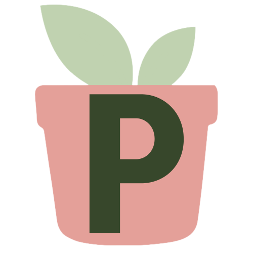
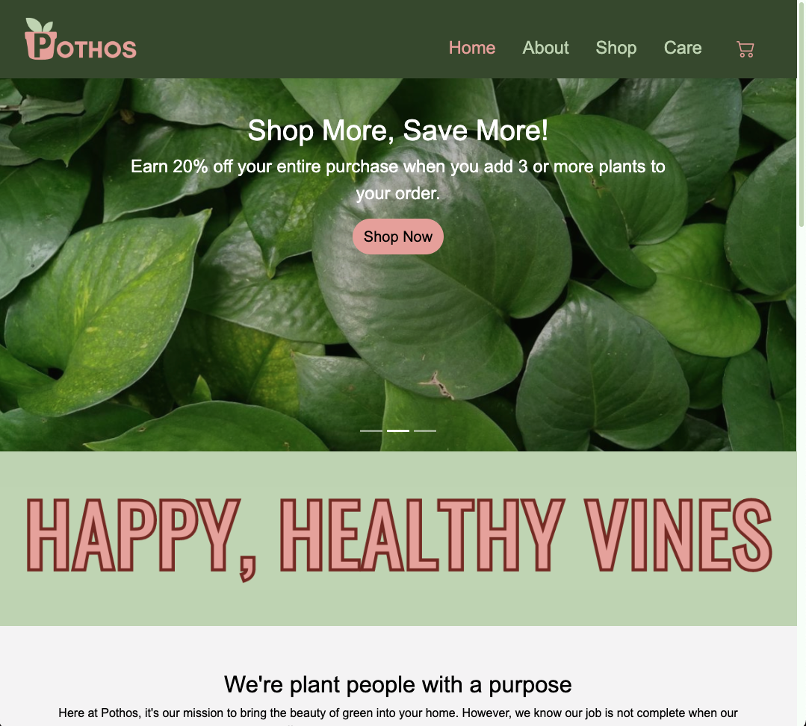
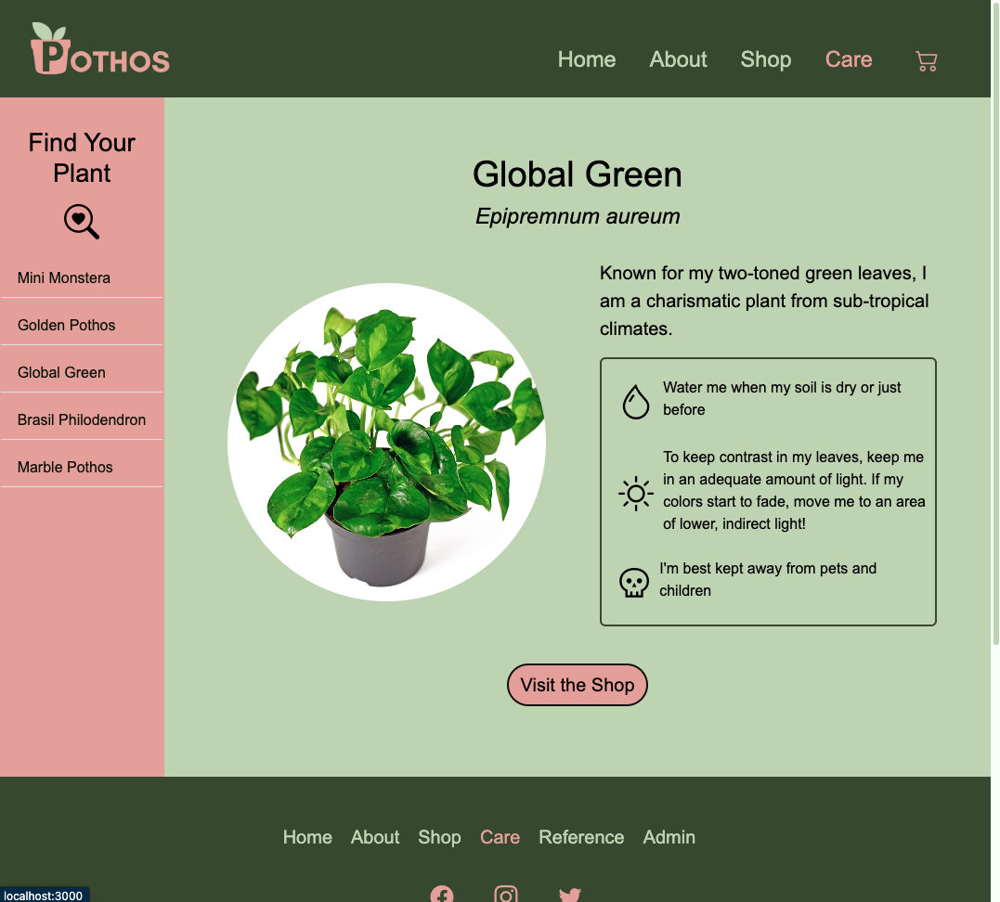
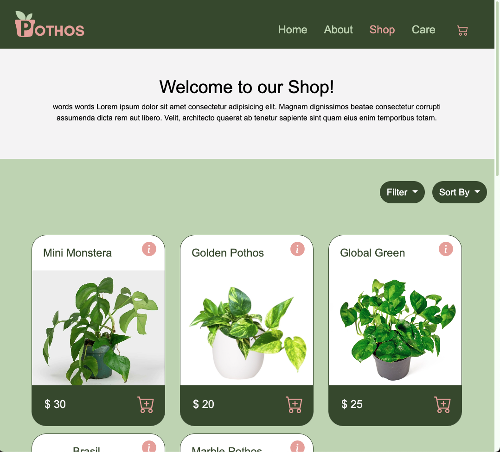
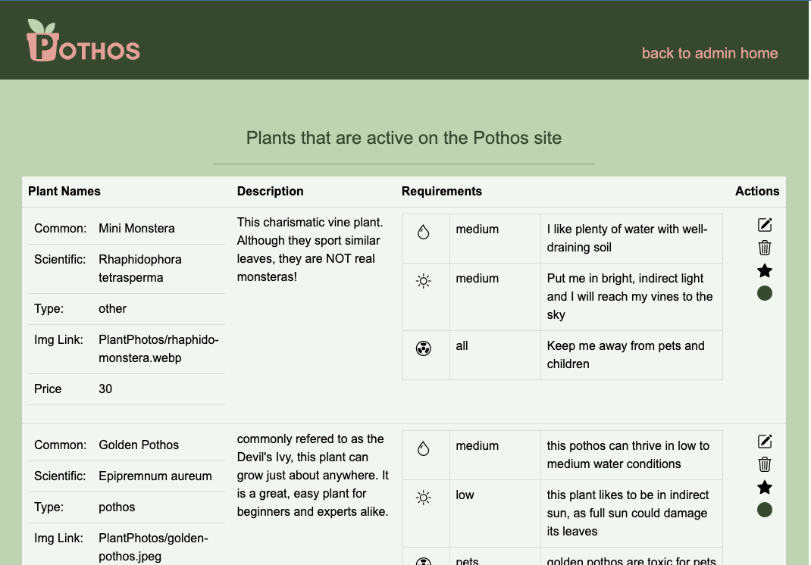

<!-- PROJECT LOGO -->
 

  

<h1 align="center">Pothos</h1>

    An online plant store committed to producing happy, healthy vines 🌱
  

  

    <a href="https://pothosplants.cyclic.cloud/"><strong>Visit Pothos Website »</strong></a>
  

<!-- TABLE OF CONTENTS -->

  
Table of Contents

  <ul>
    <li><a href="#about-the-project">About</a></li>
    <li><a href="#built-with">Built With</a></li>
    <li><a href="#roadmap">Road Map</a></li>
    <li><a href="#contact-me">Contact Me</a></li>
  </ul>

<!-- ABOUT THE PROJECT -->
## About The Project

### Client Views
Pothos is an e-commerce site that sells vining houseplants and offers care suggestions to improve the life of plants once they are in the home. 

    
    
    

### Admin Views
Admins are able to edit the plant database with ease through the Pothos admin portal. Functionality includes adding, editing, updating, and deleting shop items from the MongoDB collection. Admins can also preview what the user will see once it is published to the site.

    

  

(<a href="#readme-top">back to top</a>)

## Built With
![HTML5][html-shield]
![CSS3][css-shield]
![JavaScript][js-shield]
[![EJS][ejs-shield]][ejs-url]
[![Bootstrap][bootstrap-shield]][bootstrap-url]
[![Express][express-shield]][express-url]
[![NodeJS][node-shield]][node-url]
[![MongoDB][mongodb-shield]][mongodb-url]

The Pothos Website is built from the ground up using Javascript and Bootstrap for front end styling and Node.js on the back end server side. 

When designing the front-facing application, the client is in mind with a web accessible, high-contrast color scheme and eye-catching custom visuals. Bootstrap CSS styles are used to give the site a clean, uniform feel. Pothos is completely responsive from small mobile screens to larger desktops. 

MongoDB is used to host the Pothos plant database containing plant names, sale details, and care information for each species featured on the site. 

(<a href="#readme-top">back to top</a>)

<!-- ROADMAP -->
## Roadmap

- Implement login system using Passport authentication
    - Allow admins to login locally to reach the admin portal
    - Allow users to login to save shopping carts and plant care information 

<!-- See the [open issues](https://github.com/github_username/repo_name/issues) for a full list of proposed features (and known issues). -->

(<a href="#readme-top">back to top</a>)

<!-- CONTACT -->
## Contact Me

View my Portfolio: [![portfolio][portfolio-shield]][portfolio-url]

Shoot me an Email: ka.lange266@gmail.com

Find me on Twitter: [![twitter][twitter-shield]][twitter-url]

Connect on Linked In: [![linkedIn][linkedin-shield]][linkedin-url]

(<a href="#readme-top">back to top</a>)

<!-- MARKDOWN LINKS & IMAGES -->
<!-- https://www.markdownguide.org/basic-syntax/#reference-style-links -->
[html-shield]: https://img.shields.io/badge/html5-%23E34F26.svg?style=for-the-badge&logo=html5&logoColor=white

[css-shield]: https://img.shields.io/badge/css3-%231572B6.svg?style=for-the-badge&logo=css3&logoColor=white

[js-shield]: https://img.shields.io/badge/javascript-%23323330.svg?style=for-the-badge&logo=javascript&logoColor=%23F7DF1E
[ejs-shield]: https://img.shields.io/badge/EJS-100000?style=for-the-badge&logo=EJS&logoColor=white&labelColor=ffffff&color=B8C972

[bootstrap-shield]: https://img.shields.io/badge/bootstrap-%238511FA.svg?style=for-the-badge&logo=bootstrap&logoColor=white
[bootstrap-url]: https://getbootstrap.com

[express-shield]: https://img.shields.io/badge/express.js-%23404d59.svg?style=for-the-badge&logo=express&logoColor=%2361DAFB
[express-url]: https://expressjs.com/

[node-shield]: https://img.shields.io/badge/node.js-6DA55F?style=for-the-badge&logo=node.js&logoColor=white
[node-url]: https://nodejs.org/en

[mongodb-shield]: https://img.shields.io/badge/MongoDB-%234ea94b.svg?style=for-the-badge&logo=mongodb&logoColor=white
[mongodb-url]: https://www.mongodb.com/

[ejs-shield]:https://img.shields.io/badge/EJS-100000?style=for-the-badge&logo=EJS&logoColor=white&labelColor=B8C972&color=B8C972
[ejs-url]:https://ejs.co/

[linkedin-shield]: https://img.shields.io/badge/linkedin-%230077B5.svg?style=for-the-badge&logo=linkedin&logoColor=white
[linkedin-url]: https://www.linkedin.com/in/ka-lange/

[twitter-shield]: https://img.shields.io/badge/@kl2662-%231DA1F2.svg?style=for-the-badge&logo=Twitter&logoColor=white
[twitter-url]: https://twitter.com/kl2662

[portfolio-shield]:https://img.shields.io/badge/PORTFOLIO-100000?style=for-the-badge&logo=Portfolio&logoColor=white&labelColor=FFFDFC&color=C77D4F
[portfolio-url]: https://karissa-lange.netlify.app/

[email-shield]: https://img.shields.io/badge/Gmail-D14836?style=for-the-badge&logo=gmail&logoColor=white
